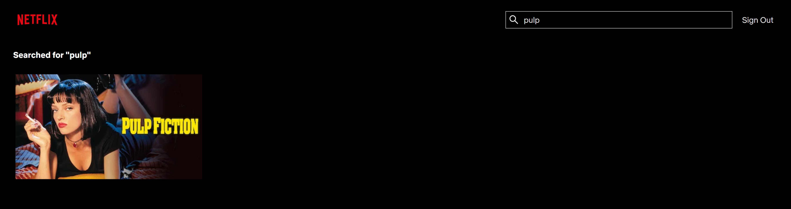
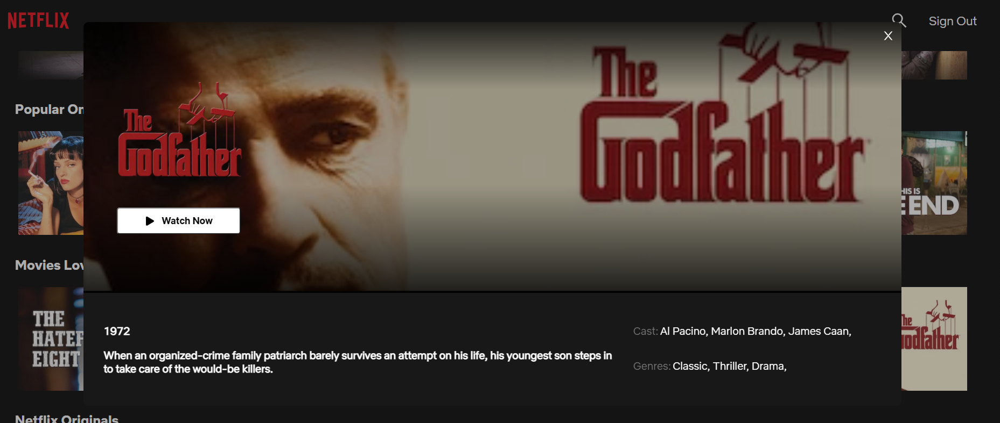
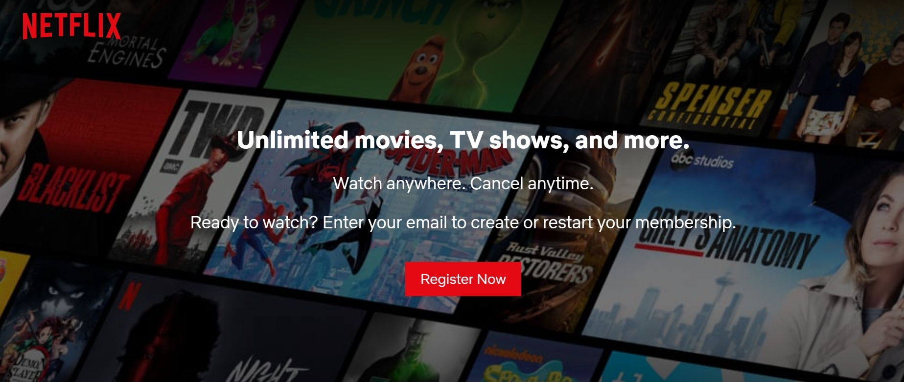
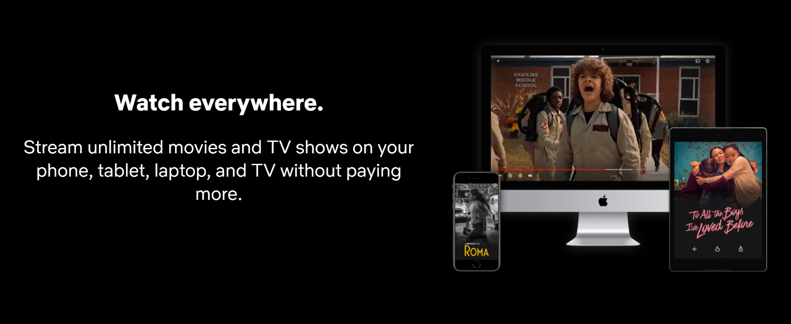
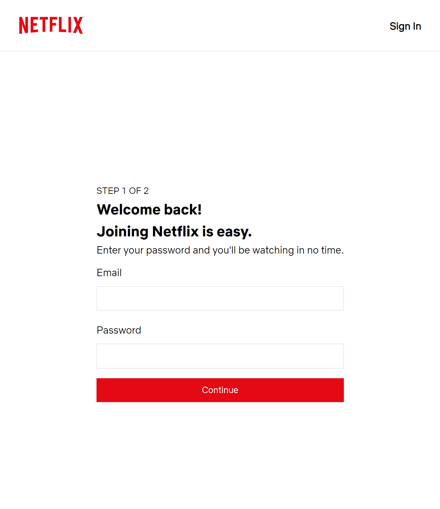
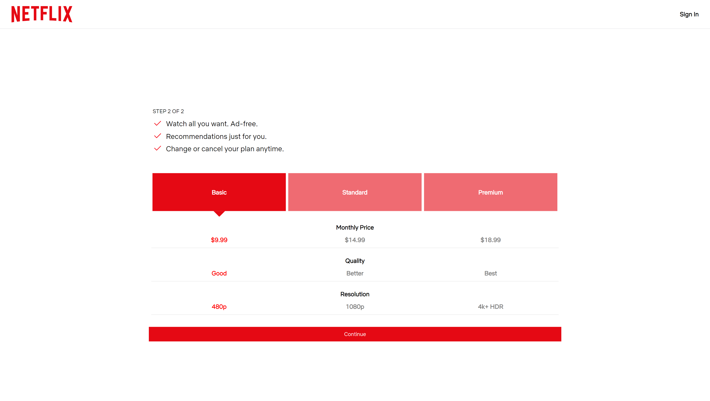
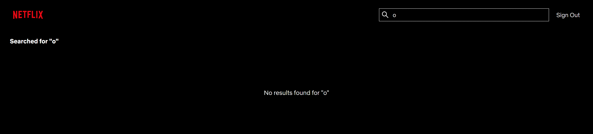

# Netflix

Replication of [Netflix website](https://www.kijiji.ca/). Database is created in BCNF (Boyce Codd Normal Form). Authentication is done via cookies that stores access tokens and refresh tokens (JWTs); users can create, edit, delete a listing, and see all listings by other users. Data is stored on PostgreSQL. Developed with React, Redux, Express, Typescript, React-Testing-Library, Jest, TravisCI, JS, HTML, CSS.

Deployment / Production repo: https://github.com/mattfrancis888/heroku-kijiji

### BCNF database graph:


## External Resources:

-   pgAdmin 4 for PostgreSQL GUI.
-   Postman to test API requests.
-   Prettier to format code and EsLint for linting.
-   Redux dev tool google chrome extension to check the values of the states.

## What It Looks Like











# Getting Started

These instructions will get you a copy of the project up and running on your local machine for development and testing purposes.

1. Clone the project. Use `npm install` to install all the dependencies. Go to the client directory, run the project with `npm start` for development or `npm run build` for production.

2. OPTIONAL: If you want to make changes locally, on the terminal, go to the `backend` directory. Type `npm run convert` to start the local server. The command would also listen to changes and convert the Express Typescript files to Express Javascript files that will be used for production. Create your own local database by restoring the pg_dump file of the kijiji database given (called ‘kijiji’ in root directory). Configure your own Pool settings in databasePool.

# Prerequisites

What things you need to install the software

```
- Any package manager (npm, yarn)
```

# Versioning

None
