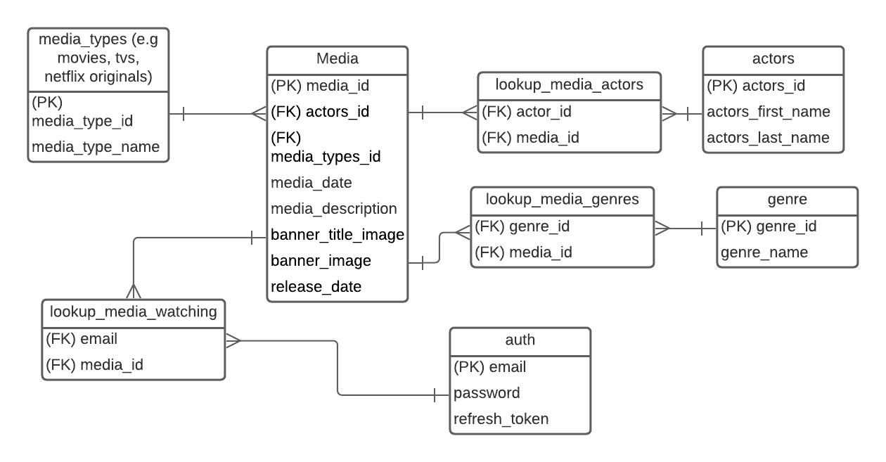
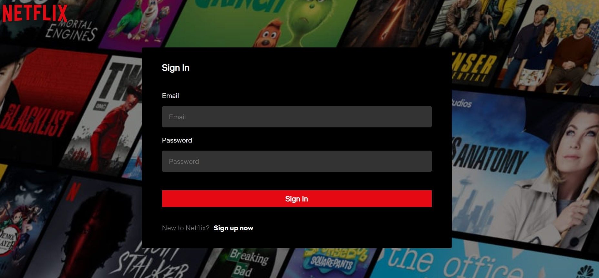

# Netflix

Replication of [Netflix website](https://www.netflix.com/ca/). Database is created in BCNF (Boyce Codd Normal Form). Authentication is done via cookies that stores access tokens and refresh tokens (JWTs); users can add and remove titles to their watchlist; and users can search for titles. Data is stored on PostgreSQL. Developed with React, Redux, Express, Typescript, React-Testing-Library, Jest, TravisCI, JS, HTML, CSS.

Deployment / Production repo: https://github.com/mattfrancis888/netflix

### BCNF database graph:



### What I learned:

-   In testing, I'm using a library that mocks HTTP requests called `nock`. The mocked HTTP request that was failing in my last project, [Kijiji](https://github.com/mattfrancis888/kijiji) was **not** related to the mock cookie. It is because the mocked API calls read an actual cookie in the request (such as Access Tokens). This could be mitigated by sending the cookie in a header with "authorization"; however, after enabling HTTP requests with a header of "authorization" in my Axios interceptor, `nock` cannot mock it. The HTTP requests will always be stuck in pending. By removing the "authorization header", the HTTP requests will be mocked as normal. After spending a lot of time and research, I cannot get `nock`` to work and will use other mocking HTTP request libraries for future projects.

## External Resources:

-   pgAdmin 4 for PostgreSQL GUI.
-   Postman to test API requests.
-   Prettier to format code and EsLint for linting.
-   Redux dev tool google chrome extension to check the values of the states.
-   React dev tool to check the value of props.

## What It Looks Like





# Getting Started

These instructions will get you a copy of the project up and running on your local machine for development and testing purposes.

1. Clone the project. Use `npm install` to install all the dependencies. Go to the client directory, run the project with `npm start` for development or `npm run build` for production.

2. OPTIONAL: If you want to make changes locally, on the terminal, go to the `backend` directory. Type `npm run convert` to start the local server. The command would also listen to changes and convert the Express Typescript files to Express Javascript files that will be used for production. Create your own local database by restoring the pg_dump file of the kijiji database given (called ‘kijiji’ in root directory). Configure your own Pool settings in databasePool.

# Prerequisites

What things you need to install the software

```
- Any package manager (npm, yarn)
```

# Versioning

None
